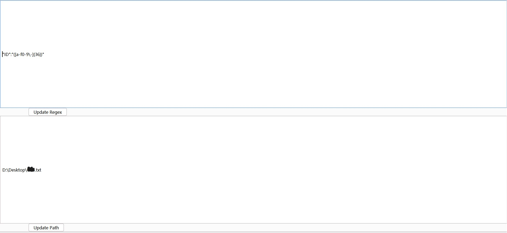
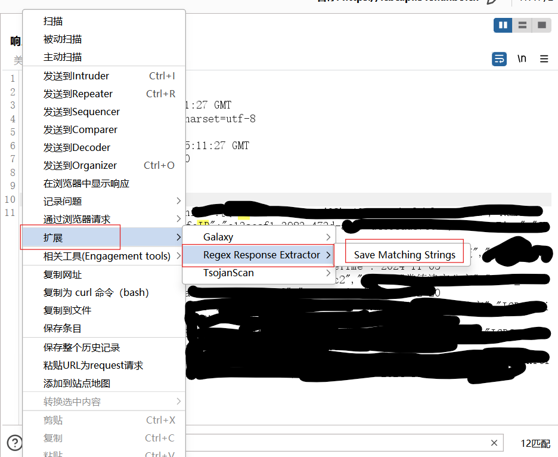

# bp_py_regular-expressions
 一个简单的bp脚本，用作过滤信息和保存信息

### 需要环境

jython	//我用的是2.7.3

# 安装

## 页面

第一个格子是输入正则表达式

第二个格子输入文件名，不写绝对路径的话就会直接生成在python脚本目录下

写好后可以直接在右键菜单运行这个正则表达式并且保存到你输入的路径下：

## 注意

1、python代码里只匹配了双引号和单引号，尾巴别接空格那些

2、因为是直接将匹配到的内容写入文件，如果有木马文件、空格字符或者换行字符可能会出些问题

3、没有检查匹配字符的过程，但是可以到扩展里的ui里看有没有匹配到